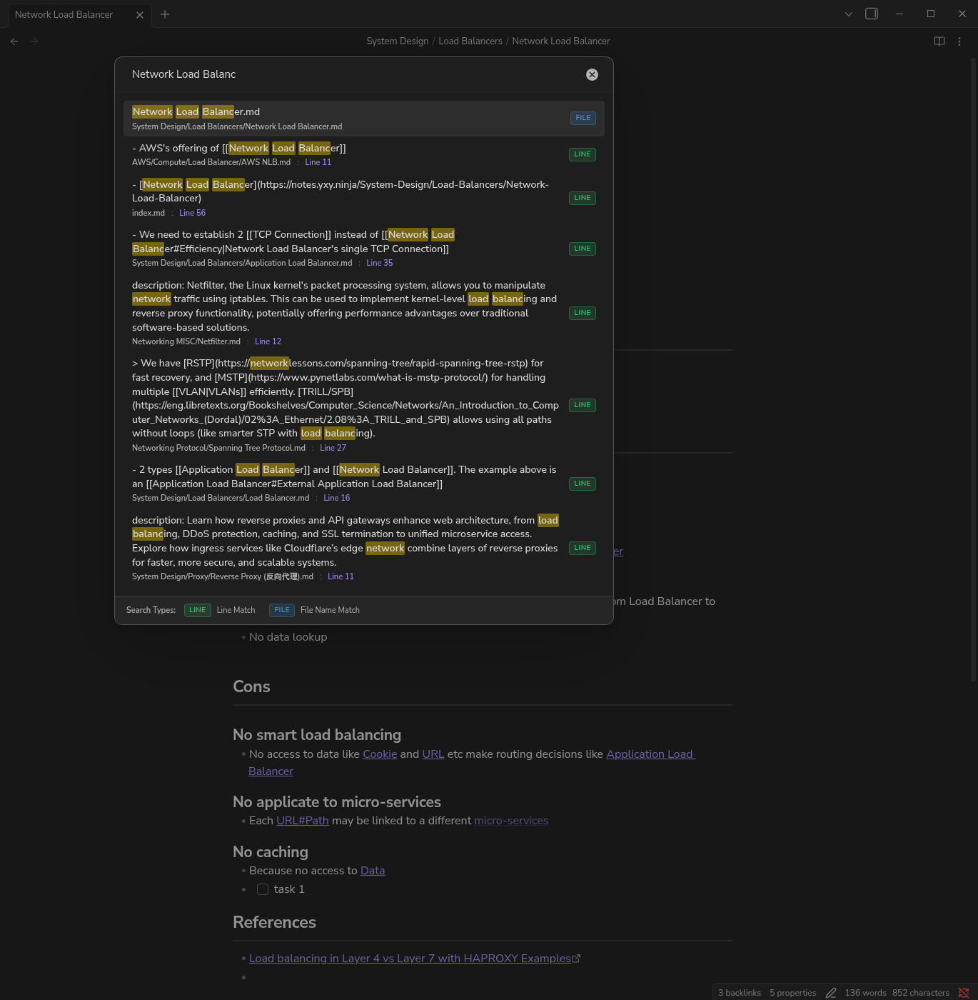

# Obsidian UltraSearch Plugin

**UltraSearch** is a high-performance community Obsidian plugin that lets you search and rank both **file names** and **individual line contents** across all Markdown files in your vault. It also features a dedicated **Gemini Chat Panel** in the sidebar to ask questions and converse with an AI assistant grounded in your notes.


---

## Use Cases

If you rely on daily notes to capture thoughts, tasks, or lists without adding tags or backlinks, finding specific information later can be challenging. Standard search tools often fail to locate these details or return irrelevant results. UltraSearch solves this by indexing and searching at the individual line level, making your notes instantly and precisely searchable. For more complex queries, you can open the UltraSearch Chat Panel to synthesize intelligent answers directly from your notes, current folder, or active file.

---

## Features

### 🔍 Fuzzy Search
1. **Unified File Name & Line-Level Search**:
   - Searches every file name and every line of every Markdown file independently.
   - Shows both matching file names and matching lines directly in the suggestions list.

2. **Harmonious Color-Coded Badges**:
   - Every result is clearly categorized using HSL-tailored, theme-compatible colored badges on the right side:
     - **Green Badge (Line)**: Indicates a line search match.
     - **Blue Badge (File)**: Indicates a file name match.
   - A static search type legend is fixed at the bottom of the modal window wrapper to define the colors clearly.

3. **Advanced Matching & Ranking**:
   - **Out-of-Order Multi-Word Search**: Querying space-separated terms (e.g. `hello world`) matches items containing all terms in any order (AND search).
   - **Exact Substring Match**: High-priority matching for exact term matches in the file name or line.
   - **Typo-Tolerant Word Prefix Match**: For query terms of 3-5 characters, matches words with up to 1 typo; for terms of 6 or more characters, matches words with up to 2 typos.
   - **Order-Aware Scoring**:
     - Sorts results descending by relevance (best match first).
     - Higher base scores for exact matches and word-boundary starts.
     - Sequence order bonus (+20 score) when terms appear in the same order as the query.
     - File matches receive a slight score boost (+10) to prioritize note files when match relevance is identical to content matches.
     - Penalizes long file names/lines slightly (by 0.01 per character) to favor shorter, more concise matches.

4. **Editor Navigation**:
   - Hitting `Enter` or clicking on a line suggestion opens the note and scrolls directly to that line.
   - Hitting `Enter` or clicking on a file suggestion opens the file at the top.
   - Support for opening files in new tabs/panes by holding the `Ctrl`/`Cmd` modifier key.

### 🤖 Gemini Chat Panel
1. **Interactive Conversational Sidebar**:
   - Access the dedicated **UltraSearch Chat** panel in the sidebar via the message-square ribbon icon or Command Palette command.
   - Converse with the AI assistant naturally with message history preserved across turns.
2. **Flexible Context Grounding**:
   - Choose the context scope dynamically: Current File, Current Folder, or Entire Vault.
   - Include or exclude linked pages from context dynamically.
3. **Web Search Grounding**:
   - Toggle **Internet Search** (powered by Google Search grounding) to supplement your vault search with real-time web results. *(Requires a Gemini API paid tier)*.
4. **Rich Rendering & Navigation**:
   - AI responses are rendered in rich Markdown.
   - Generated citation cards appear as clickable badges, scrolling your active editor pane directly to the exact file or source line.

---

## How to Use

- **Fuzzy Search**: Click the magnifying glass ribbon icon on the left sidebar or open the Command Palette (`Ctrl/Cmd + P`), select `UltraSearch: Open`, and type your search query. Use arrow keys/mouse to navigate and press `Enter` to open matches.
- **Gemini Chat**: Click the message-square ribbon icon in the left sidebar or select `UltraSearch: Open Chat Panel` in the Command Palette to open the sidebar view. Configure context scope, model, and internet search settings, and type your prompt.

---

## Adding your Gemini API Key

To use the Gemini chat feature, you need to provide a Gemini API key. For security reasons, the key must be stored securely using the Obsidian keychain rather than in plaintext settings.

1. **Get an API Key**: Obtain a free API key from [Google AI Studio](https://aistudio.google.com/).
2. **Store the Secret**: Open **Keychain** in Obsidian and save your API key securely under a Secret ID (e.g., `gemini-api-key`).
3. **Configure UltraSearch**:
   - Go to Obsidian **Settings** -> **UltraSearch**.
   - Under the "Gemini API Key Secret" setting, select the Secret ID you used in the previous step.

---

## Settings

* **Minimum query length**: The minimum characters you need to type before the search starts.
* **Maximum results**: The maximum number of results to display in the list (defaults to `10` to keep rendering fast).
* **Exclude folders**: Comma-separated list of directories (e.g., `templates, archive`) to ignore during line indexing.
* **Gemini API Key Secret**: Select the securely stored Secret ID containing your API key.

---

## Security & Privacy

### Vault Enumeration & Data Access
This plugin uses the Obsidian API (`app.vault.getMarkdownFiles`) to discover Markdown files in your vault.
* **Fuzzy Search (Local-First)**: All indexing, scanning, and search matching run entirely on your local machine. No vault data, file paths, or search queries ever leave your device or get transmitted over the internet.
* **Gemini Chat**: When using the Gemini Chat Panel, the text contents of files within your selected context scope (File, Folder, or Vault) will be sent to the Google Gemini API to generate an answer. Be mindful of sensitive data when using the "Entire Vault" context.

---

## License

This project is licensed under the MIT License.

---

## Local Development & Installation

### Building From Source
If you are compiling this plugin from source:
1. Clone or download the repository files.
2. Open a terminal in the plugin directory and run:
   ```bash
   npm install
   ```
3. Compile and bundle the plugin:
   ```bash
   npm run build
   ```
   This will generate a `build/` folder containing the compiled code bundle (`main.js`), metadata (`manifest.json`), and stylesheets (`styles.css`).

### Loading into Obsidian
1. Copy the `build` folder into your Obsidian vault's plugins folder under the name `ultra-search`:
   ```bash
   cp -r build <path-to-your-vault>/.obsidian/plugins/ultra-search
   ```
2. Open Obsidian and go to **Settings** -> **Community plugins**.
3. Enable **UltraSearch** from the list of installed plugins.
